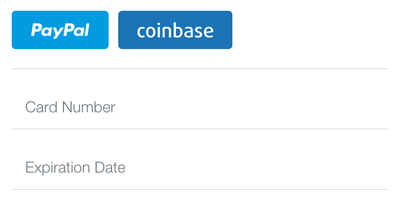

# Volt::Braintree

A wrapper around the [Braintree gem](https://github.com/braintree/braintree_ruby) that provides you with a way to load the [Braintree v.zero Drop-in](https://github.com/braintree/braintree_ruby) with 1 line of code.

## Installation

Add this line to your application's Gemfile:

    gem 'volt-braintree'

And then execute:

    $ bundle

Or install it yourself as:

    $ gem install volt-braintree

And then add the dependency to your `dependecies.rb`

    $ component 'braintree'

## Usage

### Configuration

Add the following initializer (e.g. `app/main/initializers/server/braintree.rb`):

```ruby
  Braintree::Configuration.environment = :sandbox
  Braintree::Configuration.merchant_id = 'your_merchant_id'
  Braintree::Configuration.public_key = 'your_public_key'
  Braintree::Configuration.private_key = 'your_private_key'
```
You can sign up for your credentials on the [Braintree website](https://www.braintreepayments.com/get-started).

### Integration

To add the Braintree form to your site simply add the component to your page:

```html
  <form e-submit='process_payment'>
    <:braintree>
  </form>
```

Which will result in this form:



You can specify additional options to generate the [ClientToken](https://developers.braintreepayments.com/javascript+ruby/reference/request/client-token/generate) by passing in arguments prefixed with the `server__` name. For example to pass the `client_id` option when generating the **ClientToken** you specify the following:

```html
   <:braintree server__customer_id='123'>
```

You can also pass in options to the loading of the [Javascript library](https://developers.braintreepayments.com/javascript+ruby/guides/drop-in) by prefixing it with `client__` as follows:

```html
  <:braintree client__form='alternative_form_name'>
````

### Processing payment

To process the payment you should add an `e-submit` listener to the surrounding form. This form will be called twice, once before the card has been tokenised and once after. If you need the payment nonce generated by Braintree simply check for it's existence.

```ruby
...
  def process_payment
    if page._payment_method_nonce
      # so something with page._payment_method_nonce
    else
      return false #stop the form from submitting
    end
  end
...
```

## Example

[This sample implementation](https://github.com/cbetta/volt-braintree-demo) of this component showcases how to process a payment after receiving the token.

## Todos

* Add a Volt Task that wraps around most of the Braintree API so you dont need to write your own runners.

## Contributing

1. Fork it ( http://github.com/cbetta/volt-braintree/fork )
2. Create your feature branch (`git checkout -b my-new-feature`)
3. Commit your changes (`git commit -am 'Add some feature'`)
4. Push to the branch (`git push origin my-new-feature`)
5. Create new Pull Request
